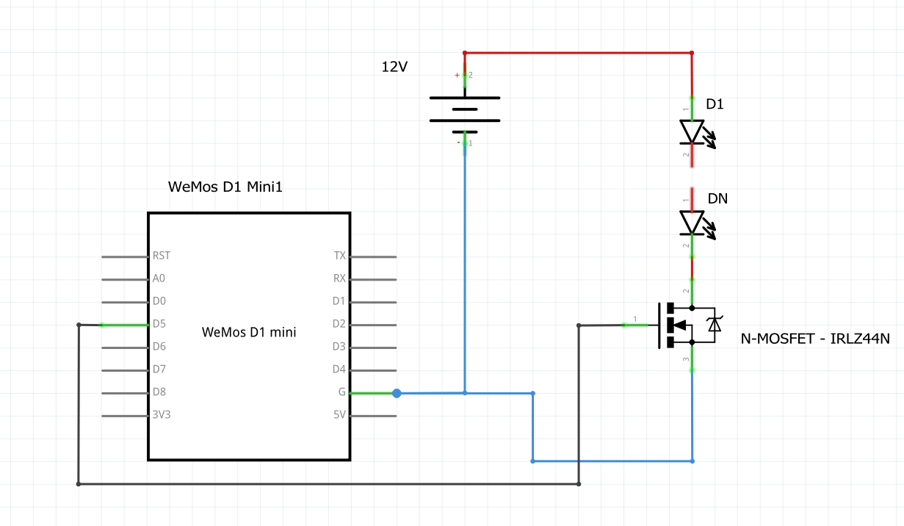

# Mqtt Dimmable Light (PWM)
A dimmable light controlled via MQTT using a PWM output.

## HOME ASSISTANT integration

Build in topics
```
Power:
- sub topic:"myDimmableLight/setPower"
- pub topic:"myDimmableLight/powerSet" 

Brightness:
 - sub topic: myDimmableLight/setBrightness 
 - pub topic: myDimmableLight/brightnessSet
```
 if headerTopic = "downstairs/livingroom/sofalight" your power topics will be:
```
downstairs/livingroom/sofalight/setPower
downstairs/livingroom/sofalight/powerSet
etc...
```

Add this in configuration.yaml
```
light:
  platform: mqtt
  name: "my_first_dimmable_light"
  command_topic: "myDimmableLight/setPower" 
  state_topic: "myDimmableLight/powerSet" 
  brightness_command_topic: "myDimmableLight/setBrightness"
  brightness_state_topic: "myDimmableLight/brightnessSet"
  payload_on: "ON"
  payload_off: "OFF"
  optimistic: false
  qos: 1
  retain: true
  ```
  
## Hardware
It can be tested with a simple led, or used with a transitor (NPN or N-Channel MOSFET) for controlling an LED Strip



